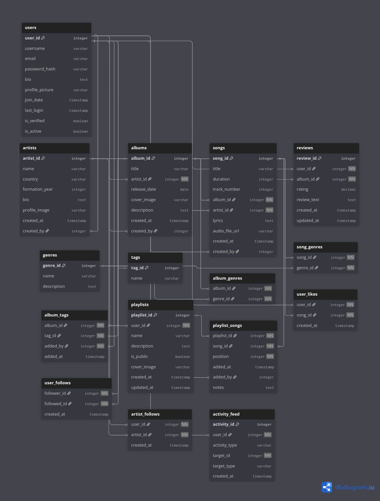
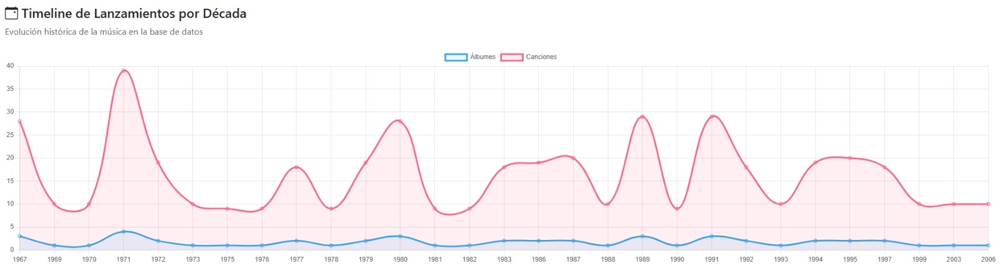
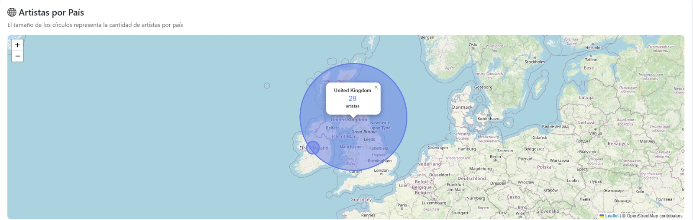
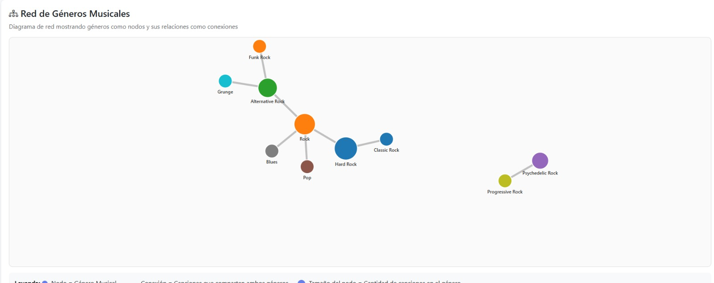
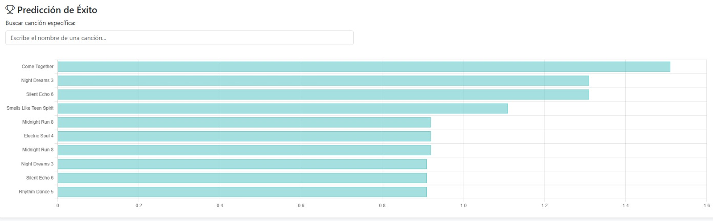
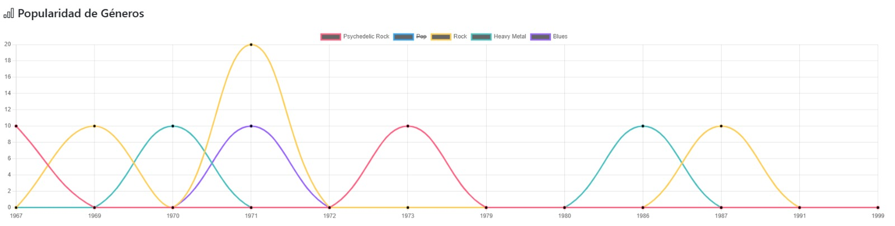
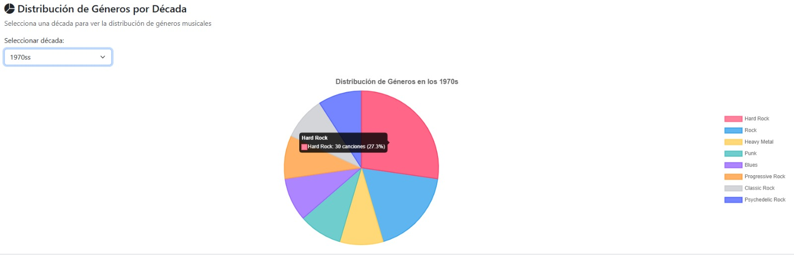
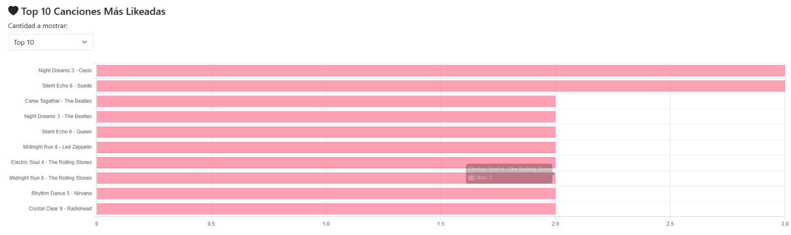

# 📊 Dashboard de Analytics - MuMusic Database

MuDB o Music Database es una aplicación web que administra y documenta el proceso musical de manera clara e intuitiva, proporcionando visualizaciones avanzadas y análisis predictivo basado en datos históricos.

## 🗄️ Esquema de Base de Datos

El sistema utiliza **MySQL 8.0+** como motor de base de datos relacional, implementando un esquema normalizado que garantiza la integridad referencial y optimiza las consultas mediante índices estratégicos.



**Tecnologías utilizadas:**
- **MySQL 8.0+**: Sistema de gestión de base de datos relacional
- **10 Vistas SQL**: Consultas pre-definidas para análisis complejos
- **Índices optimizados**: Mejora el rendimiento en consultas frecuentes

---

## 📈 Visualizaciones de Analytics

### 1. Timeline de Lanzamientos por Década

Esta visualización muestra la evolución histórica de la industria musical, agrupando álbumes y canciones por década desde los años 1960 hasta 2020.



**Query SQL utilizado:**
```sql
-- Vista: vw_popularity_trends_by_decade
SELECT 
    FLOOR(YEAR(al.release_date) / 10) * 10 as decade,
    COUNT(DISTINCT al.album_id) as album_count,
    COUNT(DISTINCT s.song_id) as song_count
FROM albums al
LEFT JOIN songs s ON al.album_id = s.album_id
GROUP BY decade
ORDER BY decade
```

**Explicación técnica:**
- Utiliza la función `FLOOR()` para redondear años a décadas (ej: 1987 → 1980)
- Cuenta álbumes y canciones únicos por década usando `COUNT(DISTINCT)`
- `LEFT JOIN` asegura que álbumes sin canciones también se incluyan
- Agrupa resultados por década y los ordena cronológicamente

**Tecnología de visualización:**
- **Chart.js**: Gráfico de barras interactivo con tooltips
- **JavaScript (Vanilla)**: Procesamiento de datos y renderizado dinámico
- **Endpoint**: `GET /api/analytics/releases-timeline`

---

### 2. Distribución Geográfica de Artistas

Mapa interactivo que visualiza la distribución mundial de artistas, mostrando la concentración de talento musical por país con círculos proporcionales.



**Query SQL utilizado:**
```sql
-- Vista: vw_artist_popularity_by_country
SELECT 
    ar.country,
    COUNT(DISTINCT ar.artist_id) as artist_count,
    COUNT(DISTINCT s.song_id) as total_songs
FROM artists ar
LEFT JOIN albums al ON ar.artist_id = al.artist_id
LEFT JOIN songs s ON al.album_id = s.album_id
GROUP BY ar.country
```

**Explicación técnica:**
- Agrupa artistas por país de origen
- Cuenta el número total de artistas únicos por país
- Calcula el total de canciones producidas por país
- `LEFT JOIN` permite incluir artistas sin álbumes o canciones

**Tecnología de visualización:**
- **Leaflet.js**: Biblioteca de mapas interactivos con marcadores dinámicos
- **OpenStreetMap**: Proveedor de tiles para el mapa base
- **JavaScript (Vanilla)**: Geocodificación y renderizado de marcadores
- **Endpoint**: `GET /api/analytics/artist-popularity-by-country`

---

### 3. Red de Géneros Musicales

Diagrama de red interactivo que muestra las conexiones entre géneros musicales basándose en canciones que comparten múltiples géneros. Los nodos representan géneros y las conexiones indican co-ocurrencias.



**Query SQL utilizado:**
```sql
-- Endpoint personalizado: /api/analytics/genre-network
-- Genera nodos (géneros)
SELECT 
    g.genre_id,
    g.name as genre_name,
    COUNT(DISTINCT sg.song_id) as song_count
FROM genres g
LEFT JOIN song_genres sg ON g.genre_id = sg.genre_id
GROUP BY g.genre_id

-- Genera conexiones (canciones compartidas)
SELECT 
    sg1.genre_id as source_genre_id,
    sg2.genre_id as target_genre_id,
    COUNT(DISTINCT sg1.song_id) as connection_strength
FROM song_genres sg1
JOIN song_genres sg2 ON sg1.song_id = sg2.song_id 
WHERE sg1.genre_id < sg2.genre_id
GROUP BY sg1.genre_id, sg2.genre_id
```

**Explicación técnica:**
- **Nodos**: Cada género es un nodo cuyo tamaño representa el número de canciones
- **Conexiones**: Las líneas entre géneros indican canciones que comparten ambos géneros
- Grosor de conexión proporcional a la cantidad de canciones compartidas
- Filtro `sg1.genre_id < sg2.genre_id` evita duplicados (Rock→Pop y Pop→Rock)

**Tecnología de visualización:**
- **D3.js v7**: Biblioteca de visualización de datos con física de fuerzas
- **Force-directed graph**: Simulación física para posicionamiento automático de nodos
- **JavaScript (Vanilla)**: Interactividad (arrastrar, zoom, tooltips)
- **Endpoint**: `GET /api/analytics/genre-network`

**Características interactivas:**
- Arrastrar nodos para reorganizar la red
- Zoom y pan para explorar detalles
- Tooltips con información detallada al pasar el mouse

---

### 4. Predicción de Éxito Musical

Algoritmo predictivo que calcula un "success score" basado en engagement del usuario (likes y apariciones en playlists) para identificar canciones con mayor potencial de éxito.



**Query SQL utilizado:**
```sql
-- Vista: vw_music_success_prediction
SELECT 
    s.song_id,
    s.title as song_title,
    ar.name as artist_name,
    COUNT(DISTINCT l.like_id) as like_count,
    COUNT(DISTINCT ps.playlist_id) as playlist_count,
    (COUNT(DISTINCT l.like_id) * 2 + COUNT(DISTINCT ps.playlist_id) * 3) as success_score
FROM songs s
JOIN albums al ON s.album_id = al.album_id
JOIN artists ar ON al.artist_id = ar.artist_id
LEFT JOIN likes l ON s.song_id = l.song_id
LEFT JOIN playlist_songs ps ON s.song_id = ps.song_id
GROUP BY s.song_id
ORDER BY success_score DESC
```

**Explicación técnica:**
- **Fórmula de éxito**: `success_score = (likes × 2) + (playlist_appearances × 3)`
- Los likes tienen peso 2 (popularidad individual)
- Las apariciones en playlists tienen peso 3 (curación y calidad)
- `LEFT JOIN` asegura incluir canciones sin likes o playlists (score = 0)
- Ordena de mayor a menor score para identificar top performers

**Tecnología de visualización:**
- **Chart.js**: Gráfico de barras horizontales con gradiente de colores
- **JavaScript (Vanilla)**: Cálculo dinámico de scores y renderizado
- **Endpoint**: `GET /api/analytics/music-success-prediction`

**Casos de uso:**
- Identificar canciones con alto potencial para promoción
- Descubrir tendencias emergentes antes de que se vuelvan mainstream
- Optimizar playlists editoriales con contenido de alto engagement

---

### 5. Popularidad de Géneros a lo Largo del Tiempo

Gráfico de líneas que muestra la evolución de la popularidad de diferentes géneros musicales desde 1960 hasta 2020, revelando tendencias y ciclos en la industria musical.



**Query SQL utilizado:**
```sql
-- Vista: vw_genre_popularity_timeline
SELECT 
    g.name as genre_name,
    YEAR(al.release_date) as year,
    COUNT(DISTINCT s.song_id) as song_count
FROM songs s
JOIN albums al ON s.album_id = al.album_id
JOIN song_genres sg ON s.song_id = sg.song_id
JOIN genres g ON sg.genre_id = g.genre_id
GROUP BY g.name, YEAR(al.release_date)
ORDER BY year, genre_name
```

**Explicación técnica:**
- Extrae el año de lanzamiento usando `YEAR(al.release_date)`
- Cuenta canciones únicas por género y año
- Agrupa por género y año para crear series temporales
- Permite identificar picos de popularidad y declives de géneros específicos

**Tecnología de visualización:**
- **Chart.js**: Gráfico de líneas multi-serie con leyenda interactiva
- **JavaScript (Vanilla)**: Procesamiento de datos temporales y colores dinámicos
- **Endpoint**: `GET /api/analytics/genre-popularity-timeline`

**Insights obtenibles:**
- Identificar el auge del Rock en los 70s y 80s
- Observar el crecimiento del Hip-Hop desde los 90s
- Detectar la explosión del Pop en los 2000s

---

### 6. Distribución de Géneros por Década

Gráfico de pastel interactivo con selector de década que muestra la composición porcentual de géneros musicales en cada período histórico.



**Query SQL utilizado:**
```sql
-- Vista: vw_genre_correlations_by_era (adaptada)
SELECT 
    g.name as genre_name,
    FLOOR(YEAR(al.release_date) / 10) * 10 as decade,
    COUNT(DISTINCT s.song_id) as song_count
FROM songs s
JOIN albums al ON s.album_id = al.album_id
JOIN song_genres sg ON s.song_id = sg.song_id
JOIN genres g ON sg.genre_id = g.genre_id
GROUP BY g.name, decade
ORDER BY decade, song_count DESC
```

**Explicación técnica:**
- Agrupa canciones por género y década
- Calcula la distribución porcentual de cada género dentro de su década
- Permite comparar la evolución de la diversidad musical a través del tiempo
- `FLOOR(YEAR(...) / 10) * 10` normaliza años a décadas

**Tecnología de visualización:**
- **Chart.js**: Gráfico de pastel (pie chart) con paleta de colores personalizada
- **JavaScript (Vanilla)**: Selector interactivo de década (1960s-2020s)
- **Endpoint**: `GET /api/analytics/genre-evolution-by-decade?decade=1980`

**Características interactivas:**
- Selector de década para cambiar dinámicamente el gráfico
- Tooltips con porcentajes exactos
- Leyenda con colores distintivos por género

---

### 7. Top Álbumes Mejor Calificados

Ranking de álbumes basado en engagement total (likes + apariciones en playlists), identificando los álbumes más apreciados por los usuarios.


**Query SQL utilizado:**
```sql
-- Endpoint: /api/analytics/top-rated-albums?limit=15
SELECT 
    al.album_id,
    al.title as album_title,
    ar.name as artist_name,
    al.cover_image,
    COUNT(DISTINCT l.like_id) as total_likes,
    COUNT(DISTINCT ps.playlist_id) as playlist_appearances,
    (COUNT(DISTINCT l.like_id) + COUNT(DISTINCT ps.playlist_id)) as rating_score
FROM albums al
JOIN artists ar ON al.artist_id = ar.artist_id
JOIN songs s ON al.album_id = s.album_id
LEFT JOIN likes l ON s.song_id = l.song_id
LEFT JOIN playlist_songs ps ON s.song_id = ps.song_id
GROUP BY al.album_id
ORDER BY rating_score DESC
LIMIT ?
```

**Explicación técnica:**
- Suma likes totales de todas las canciones del álbum
- Cuenta en cuántas playlists aparecen canciones del álbum
- **Rating score**: `total_likes + playlist_appearances`
- `LEFT JOIN` incluye álbumes sin engagement (score = 0)
- Parámetro `limit` permite ajustar el top (10, 15, 20)

**Tecnología de visualización:**
- **Chart.js**: Gráfico de barras horizontales con imágenes de portadas
- **JavaScript (Vanilla)**: Selector dinámico de top (10/15/20 álbumes)
- **Endpoint**: `GET /api/analytics/top-rated-albums?limit=15`

**Características adicionales:**
- Imágenes de portadas de alta calidad (Unsplash)
- Selector de cantidad de resultados (top 10, 15, 20)
- Información detallada en tooltips (artista, año, rating)

---

### 8. Top Canciones Más Likeadas

Ranking de canciones más populares basado exclusivamente en el número de likes recibidos por los usuarios.



**Query SQL utilizado:**
```sql
-- Endpoint: /api/analytics/top-liked-songs?limit=10
SELECT 
    s.song_id,
    s.title as song_title,
    ar.name as artist_name,
    al.title as album_title,
    COUNT(l.like_id) as like_count
FROM songs s
JOIN albums al ON s.album_id = al.album_id
JOIN artists ar ON al.artist_id = ar.artist_id
LEFT JOIN likes l ON s.song_id = l.song_id
GROUP BY s.song_id
ORDER BY like_count DESC
LIMIT ?
```

**Explicación técnica:**
- Cuenta el número total de likes por canción
- `LEFT JOIN` permite incluir canciones sin likes (like_count = 0)
- Ordena descendentemente por cantidad de likes
- Parámetro `limit` configurable (10, 20, 30)

**Tecnología de visualización:**
- **Chart.js**: Gráfico de barras con degradado de colores
- **JavaScript (Vanilla)**: Selector interactivo de top (10/20/30 canciones)
- **Endpoint**: `GET /api/analytics/top-liked-songs?limit=10`

---

## 🔧 Stack Tecnológico del Dashboard

### Backend
- **Node.js v18+**: Runtime de JavaScript del lado del servidor
- **Express.js**: Framework web minimalista y flexible
- **MySQL2**: Driver de MySQL con soporte para Promises
- **express-validator**: Validación de parámetros de API
- **cors**: Manejo de Cross-Origin Resource Sharing

### Frontend
- **JavaScript (Vanilla ES6+)**: Lógica del cliente sin frameworks pesados
- **Chart.js v3**: Biblioteca de gráficos responsivos y animados
- **D3.js v7**: Visualización de datos avanzada (red de géneros)
- **Leaflet.js v1.9**: Mapas interactivos con marcadores personalizados
- **Bootstrap 5**: Framework CSS para diseño responsive
- **Bootstrap Icons**: Iconografía moderna y escalable

### Base de Datos
- **MySQL 8.0+**: Sistema de gestión de base de datos relacional
- **10 Vistas SQL**: Consultas optimizadas para analytics
- **Índices compuestos**: Mejora de rendimiento en JOINs complejos
- **Pool de conexiones**: 10 conexiones simultáneas para alta concurrencia

### Arquitectura
```
[MySQL Database] 
    ↓ (SQL Views & Queries)
[Backend API - Express.js]
    ↓ (REST Endpoints JSON)
[Frontend - Vanilla JavaScript]
    ↓ (Chart.js / D3.js / Leaflet)
[Visualizaciones Interactivas]
```

---

## 📊 Endpoints de Analytics Disponibles

| Endpoint | Método | Descripción |
|----------|--------|-------------|
| `/api/analytics/dashboard-summary` | GET | Resumen general del dashboard |
| `/api/analytics/genre-popularity-timeline` | GET | Popularidad de géneros en el tiempo |
| `/api/analytics/artist-popularity-by-country` | GET | Distribución geográfica de artistas |
| `/api/analytics/genre-network` | GET | Red de géneros musicales (D3.js) |
| `/api/analytics/music-success-prediction` | GET | Predicción de éxito musical |
| `/api/analytics/top-liked-songs?limit=10` | GET | Top canciones más likeadas |
| `/api/analytics/top-rated-albums?limit=15` | GET | Álbumes mejor calificados |
| `/api/analytics/releases-timeline` | GET | Timeline de lanzamientos por década |
| `/api/analytics/genre-evolution-by-decade?decade=1980` | GET | Evolución de géneros por década |
| `/api/analytics/low-success-songs?limit=15` | GET | Canciones con menor éxito |

---

## 🚀 Características Técnicas

### Rendimiento
- ✅ Pool de conexiones MySQL (10 conexiones concurrentes)
- ✅ Índices optimizados en columnas frecuentemente consultadas
- ✅ Vistas materializadas para análisis complejos
- ✅ Consultas con JOINs eficientes y `EXPLAIN` optimizado

### Escalabilidad
- ✅ Arquitectura modular separada (frontend/backend)
- ✅ API RESTful bien estructurada
- ✅ Fácil de extender con nuevas visualizaciones
- ✅ Preparado para caché con Redis (futuro)

### Seguridad
- ✅ Consultas parametrizadas (prevención de SQL injection)
- ✅ Validación de parámetros con express-validator
- ✅ CORS configurado para desarrollo seguro
- ✅ Autenticación JWT para endpoints protegidos

---

## 📈 Casos de Uso del Dashboard

1. **Análisis de Tendencias**: Identificar géneros emergentes y en declive
2. **Descubrimiento de Conexiones**: Explorar relaciones entre géneros musicales
3. **Predicción de Éxito**: Detectar canciones con alto potencial comercial
4. **Análisis Geográfico**: Mapear la distribución global del talento musical
5. **Optimización de Playlists**: Curar contenido basado en datos de engagement
6. **Investigación Musical**: Estudiar la evolución histórica de la industria

---

<div align="center">

### 🎵 **Dashboard Analytics - Powered by Data** 🎵

</div>